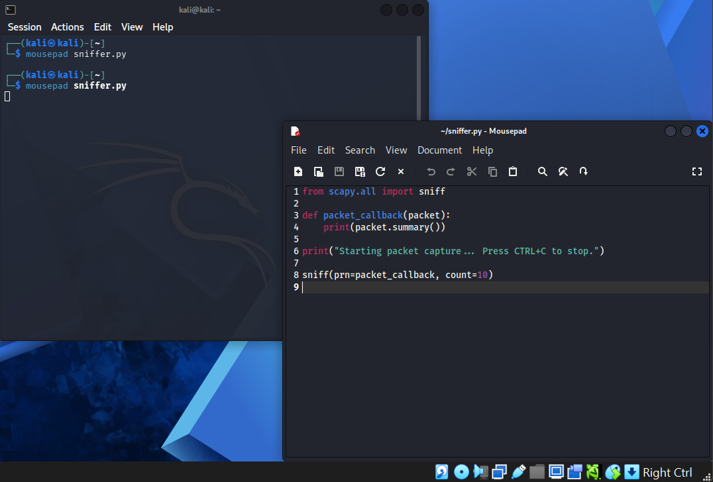
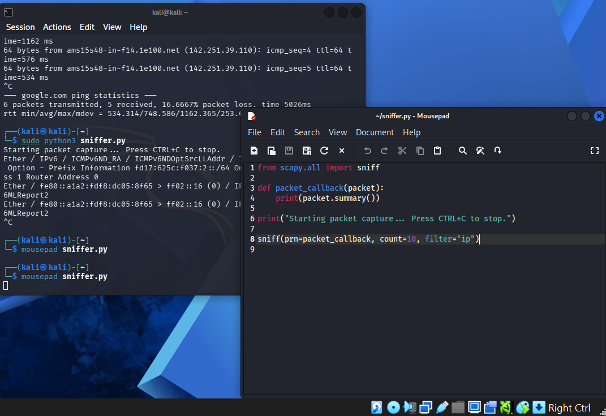
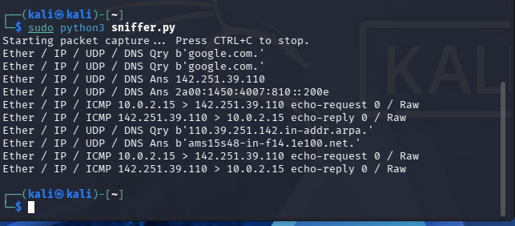
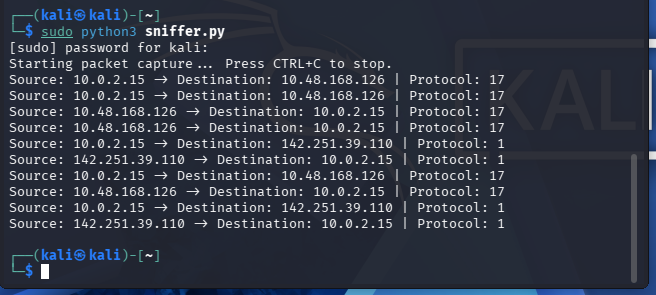
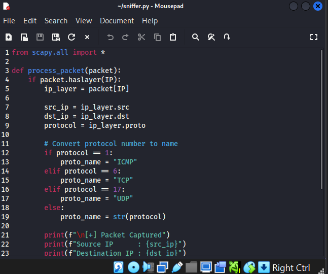
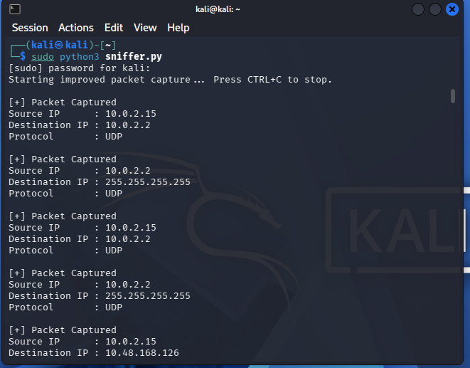
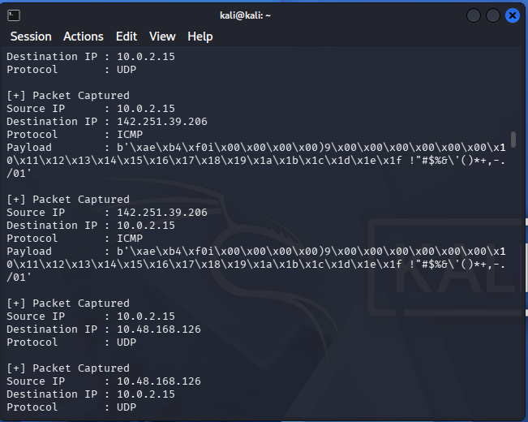
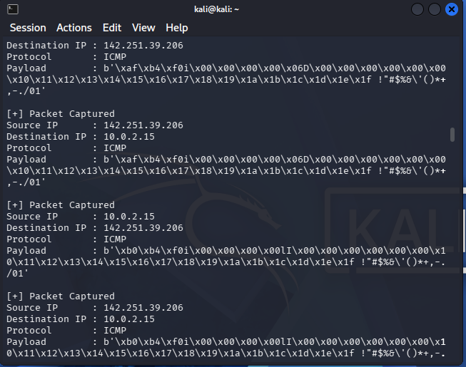
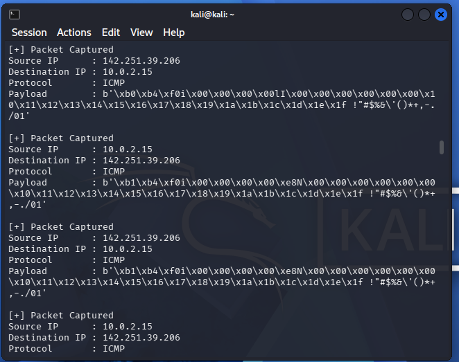

CYBER INTERNSHIP TASK

Objective:
Create a network sniffer to capture and analyze network traffic packets, to understand how data flows through a network.

Tools used:
Python  
Scapy  
Kali Linux  

Implemented features:

Packet capture using scapy  
Extraction of:  
 Source IP  
 Destination IP  
 Protocol (ICMP, UDP)  
 Payload data  

(1) Build a python program to capture network traffic packet

sniffer.py  

Screenshot:  

Modified script to capture traffic source, destination, and protocol  

Screenshot:  

Analyzing captured packet  

Screenshot:  

source Ip (kali machine) = 10.0.2.15  

protocol 17 = UDP  
Protocol 1 = ICMP  

My machine sent a ping request to google using ICMP protocol  

source Ip 10.0.2.15 sent an ICMP ping request via 10.48.168.126 which is an internal ip translator to destination ip 142.251.39.110  

the destination ip 142.251.39.110 sent an ICMP echo reply to my ping request @ 10.0.2.15  

protocol 17 is a UDP protocol that is captured when DNS query is made  

from 10.0.2.15 to DNS server  

this goes to show that with every echo request, there is an echo reply.  

protocol define how data is communicated over the internet  

ICMP 1 = Ping used for connectivity test  

UDP 17 = used for streaming.  

HOW DATA FLOWS THROUGH THE NETWORK  

Observations from captured output  

Screenshot:  

local machine(Kali VM) 10.0.2.15  
External server(Google) 142.251.39.110  
Protocol 1 - ICMP (used for ping)  
protocol 17 - UDP ( for fast delivery, query, streaming )  

DATA FLOW EXPLANATION  

request-response is the model network communication follow  

client sends request ( 10.0.2.15 - 142.251.39.110 )  
server replies (142.251.39.110 - 10.0.2.15)  

additional observation  
10.48.168.126 - this is a private network IP that represents an intermediate network (gateway/NAT)  

packets structure contains structured layers such as  
Ethernet, IP, Transport, Data )  

internal IP are IP that sits between the local machine and the external server as a gateway/NAT  

Protocol define how data is transmitted  

PACKET CAPTURE USING SCAPY/DISPLAY SOURCE/DESTINATION IPs, PROTOCOLS AND PAYLOAD  

Observations:  

Screenshot:  

During packet capture, different types of traffic were identified:  

Packet Captured  
Source IP : 10.0.2.15 (local machine/VM)  
Destination IP : 10.0.2.2 (External server; Google)  
Protocol : UDP (communication protocol) used for fast communication.  

Broadcast Traffic: 255.255.255.255  
Broadcast packets are sent to all devices in the network, commonly used in DHCP  

Payload Data:Binary data observed in packets.  

protocols_srcdst_payload

Screenshot 1  

Screenshot 2  

payload contain actual transmitted data.  
protocols like ICMP carry non-readable binary data  

Screenshot 3  

Screenshot 4  

Learning Outcomes  

Understood how packets move between source and destination  
Learned differences between protocols:  
ICMP = connectivity testing  
UDP = fast, connectionless communication  
Observed real-time network activity  
Gained hands-on experience with packet sniffing  

This project successfully demonstrates packet capturing and analysis, providing insight into how data flows through networks and how protocols operate at a basic level.
